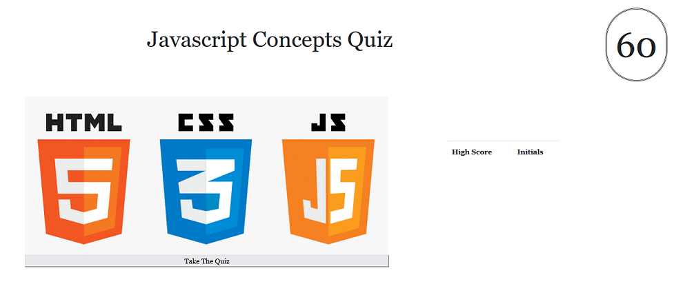

# Timed Coding Quiz

## Description

This is a short timed coding quiz mostly about javascript.
Building this allowed me to familiarize myself with and implement local storage.
As well as more practice with for loops, if statements, and creating html elements
with Javascript.
The quiz is usefull for some syntax review.

## Installation

N/A

## Usage

To use this application simple go to the webpage here https://matwll.github.io/timed-coding-quiz/.
Once on the webpage click start quiz and you can select your answers. Each wrong answer will deduct
time from the remaining time. When the timer reaches 0 or all questions are answer you will be given
a change to submit your initials and store your score.

## License

MIT License